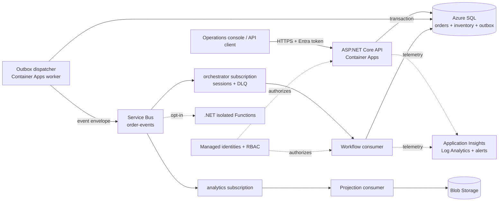
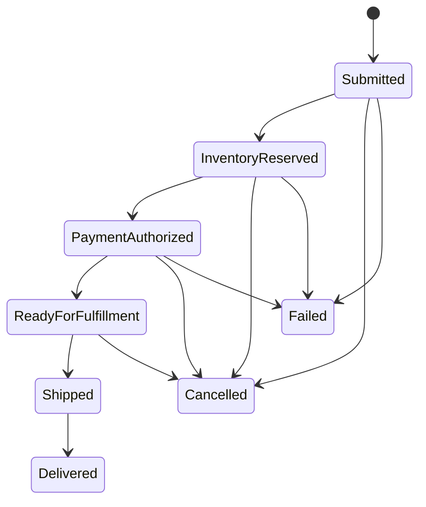

# OrderGrid — Azure Resilient Order Platform

[](https://github.com/dragon122177/azure-resilient-order-platform/actions/workflows/ci.yml)
[](https://github.com/dragon122177/azure-resilient-order-platform/actions/workflows/codeql.yml)
[](https://dotnet.microsoft.com/)
[](https://azure.microsoft.com/)
[](LICENSE)

A production-minded reference platform for accepting, orchestrating, and observing orders on Microsoft Azure. It demonstrates reliable asynchronous workflows, tenant isolation, idempotent APIs, transactional messaging, least-privilege identity, infrastructure as code, and operational readiness—not just CRUD endpoints.

The repository runs locally with SQLite and an in-process workflow path. Azure mode switches the same application boundaries to Azure SQL, Azure Service Bus, Blob Storage, Container Apps, Key Vault, managed identities, Application Insights, and Azure Monitor.

> Portfolio scope: this is an original reference implementation with synthetic demo data and a deterministic payment simulator. It has not processed real customer or payment traffic. The architecture and trade-offs are documented so every claim can be explained and defended.

## Reliability features

- `Idempotency-Key` prevents duplicate API effects and detects key reuse with a changed payload.
- A transactional outbox commits business state and publish intent together.
- Service Bus sessions preserve per-order ordering; inbox records deduplicate consumers.
- Dead-letter handling separates deterministic poison messages from transient failures.
- Optimistic concurrency protects order and inventory changes.
- Cancellation and simulated payment decline release inventory in the same transaction.
- Correlation IDs join HTTP requests, audits, events, messages, and telemetry.
- Entra ID, managed identities, Key Vault, and scoped RBAC avoid Azure credentials in code.
- OpenTelemetry exports signals to Azure Monitor/Application Insights.

## Architecture



The default topology is a modular monolith plus worker. It keeps local development and database transactions understandable while preserving domain, application, infrastructure, API, and asynchronous-host boundaries.

### State machine



## Repository map

```text
src/
  OrderGrid.Domain/          Aggregates, events, invariants, value objects
  OrderGrid.Application/     Use cases, ports, contracts, orchestration
  OrderGrid.Infrastructure/  EF Core, Azure adapters, outbox/inbox, storage
  OrderGrid.Api/             Minimal API, Entra auth, policies, health, OpenAPI
  OrderGrid.Worker/          Dispatcher, session consumer, Blob projection
  OrderGrid.Functions/       Optional isolated trigger/timer extension
tests/                       Domain, application/SQLite, and API tests
web/                         React/TypeScript operations console
infra/                       Modular Bicep for an Azure environment
docs/                        Architecture, security, reliability, runbooks
dev/                         Service Bus emulator configuration
```

## Technology decisions

| Concern | Choice | Reason |
|---|---|---|
| Runtime | C# / .NET 10 | LTS runtime and first-class Azure SDK support |
| HTTP | ASP.NET Core Minimal APIs | Explicit small surface with policies and middleware |
| Persistence | EF Core + Azure SQL | Transactions, relational invariants, concurrency |
| Messaging | Service Bus topics | Durable pub/sub, sessions, duplicate detection, DLQ |
| Compute | Container Apps | Managed containers and KEDA-driven scaling |
| Serverless | .NET isolated Functions | Optional event and timer extension |
| Files | Blob Storage | Durable projections without shared disks |
| Security | Entra, Managed Identity, Key Vault | Keyless Azure data-plane access |
| Telemetry | OpenTelemetry + Azure Monitor | Correlated vendor-neutral instrumentation |
| IaC | Bicep | Modular and repeatable Azure provisioning |
| Console | React + TypeScript | Typed operator experience with explicit demo labeling |

## Run locally

Prerequisites: .NET SDK 10.0.400+ and Node.js 24+.

```bash
dotnet restore OrderGrid.slnx
ASPNETCORE_URLS=http://localhost:8080 dotnet run --project src/OrderGrid.Api
```

In a second terminal, from the same repository root:

```bash
dotnet run --project src/OrderGrid.Worker
```

In a third terminal:

```bash
npm --prefix web ci
npm --prefix web run dev
```

Open `http://localhost:5173`. The dashboard labels its source as `API data` or `Demo data`; synthetic fallback metrics are never presented as live results.

Create a test order:

```bash
curl --request POST http://localhost:8080/api/v1/orders \
  --header 'Content-Type: application/json' \
  --header 'Idempotency-Key: demo-order-00000001' \
  --header 'X-Tenant-ID: demo' \
  --data @samples/create-order.json
```

Replay the same request and key to receive the stored response with `Idempotency-Replayed: true`. Change the payload while preserving the key to receive `409 Conflict`.

## API surface

| Method | Path | Purpose |
|---|---|---|
| `GET` | `/health/live` | Process liveness |
| `GET` | `/health/ready` | Database readiness |
| `GET` | `/openapi/v1.json` | Generated API contract |
| `POST` | `/api/v1/orders` | Idempotent order submission |
| `GET` | `/api/v1/orders` | Tenant-scoped pagination/filtering |
| `POST` | `/api/v1/orders/{id}/cancel` | Compensating cancellation |
| `POST` | `/api/v1/orders/{id}/ship` | Carrier/tracking transition |
| `POST` | `/api/v1/orders/{id}/deliver` | Delivery transition |
| `GET` | `/api/v1/operations/metrics` | Workflow metrics |
| `GET` | `/api/v1/operations/inventory` | Reservation pressure |
| `GET` | `/api/v1/operations/audit` | Correlated audit trail |

## Local Azure emulators

```bash
docker compose up -d
```

Compose provides the Microsoft Service Bus emulator with SQL Server 2022 plus Azurite. Set `Infrastructure__MessagingMode=ServiceBus` and the local-only values in `.env.example` when testing AMQP sessions and subscriptions.

## Verification

```bash
make verify
```

CI builds and tests .NET and React, collects coverage, compiles/formats Bicep, builds both containers, runs CodeQL for C# and JavaScript/TypeScript, and schedules dependency updates.

## Azure deployment

The Bicep baseline creates ACR, Container Apps, Service Bus, Azure SQL, Blob Storage, Key Vault, managed identities/RBAC, Application Insights, Log Analytics, and alerts. GitHub Actions uses Azure OIDC rather than a long-lived client secret.

The first deployment bootstraps the registry with a public image, pushes commit-SHA-tagged application images, and then activates the immutable API and worker revisions. See [Azure deployment](docs/AZURE_DEPLOYMENT.md).

```bash
az deployment group what-if \
  --resource-group ordergrid-dev-rg \
  --template-file infra/main.bicep \
  --parameters environmentName=dev sqlAdministratorPassword='<secure-value>'
```

The default is a cost-conscious learning baseline with public endpoints protected by TLS and identity. Production must add private endpoints, VNet integration, Entra-only SQL access, APIM/Front Door, load tests, backup/restore exercises, and measured SLOs. Those gaps are explicit rather than disguised.

## Documentation

- [Architecture](docs/ARCHITECTURE.md)
- [API and examples](docs/API.md)
- [Data model](docs/DATA_MODEL.md)
- [Security and threat model](docs/SECURITY.md)
- [Reliability model](docs/RELIABILITY.md)
- [Observability](docs/OBSERVABILITY.md)
- [Testing strategy](docs/TESTING.md)
- [Operational runbooks](docs/RUNBOOKS.md)
- [Azure deployment](docs/AZURE_DEPLOYMENT.md)
- [Local development](docs/LOCAL_DEVELOPMENT.md)
- [Cost model](docs/COST_MODEL.md)
- [Five-minute demo](docs/DEMO_SCRIPT.md)
- [Interview guide](docs/INTERVIEW_GUIDE.md)
- [Optional Functions extension](docs/FUNCTIONS_EXTENSION.md)
- [Guía de estudio en español](PROJECT_GUIDE_ES.md)
- [Architecture decision records](docs/adr/)

## License

[MIT](LICENSE)
