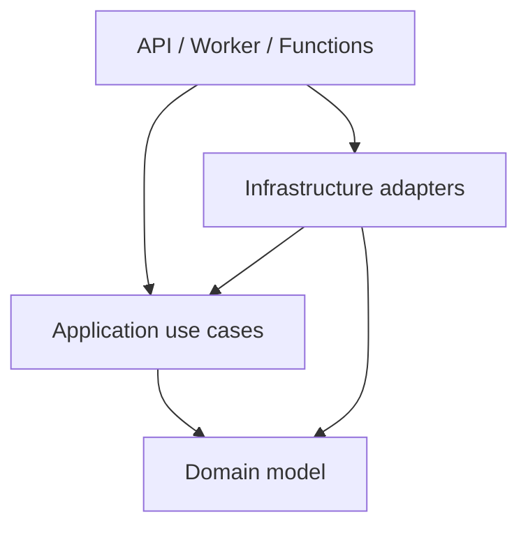
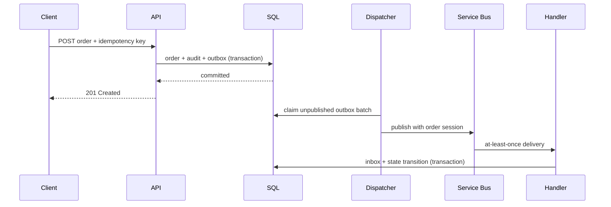

# Architecture

## Goals and boundaries

OrderGrid accepts tenant-scoped orders, advances them through a durable workflow,
and gives operators enough evidence to diagnose delayed or failed work. The design
optimizes for correctness, explainability, and a low-cost reference deployment.

The code is split into domain, application, infrastructure, and host projects.
Dependencies point inward: the domain does not know EF Core or Azure; application
use cases depend on ports; infrastructure implements those ports; API, worker, and
Functions projects compose the process.

## Write and delivery path

The database transaction is the consistency boundary. Service Bus is deliberately
treated as at-least-once. A stable event ID, an inbox table, and idempotent state
transitions prevent repeated delivery from repeating a business effect.

## Runtime topology

- API: synchronous commands, queries, authentication, authorization, OpenAPI.
- Dispatcher/consumer worker: publishes the outbox and advances order workflows.
- Analytics consumer: writes a deliberately simple Blob projection.
- Functions: opt-in example for a Service Bus trigger and reconciliation timer.
- React console: reads operations endpoints; fallback demo data is labeled.

## Failure boundaries

| Failure | Behavior |
|---|---|
| Client retries POST | Stored idempotent response is replayed |
| Database commit fails | Neither order nor outbox intent is committed |
| Publish fails | Outbox remains pending and is retried with backoff |
| Consumer crashes after handling | Message may return; inbox blocks duplicate effect |
| Poison event | Bounded delivery ends in the subscription DLQ |
| Payment simulator declines | Inventory is released and order becomes `Failed` |
| Projection storage fails | Analytics delivery retries independently of workflow |

## Evolution

The current modular monolith avoids premature distributed transactions. A module
should become a service only when it needs independent scaling, ownership, release
cadence, data isolation, or availability. The event contracts and ports provide a
seam, but extraction would require versioned schemas and explicit data ownership.
