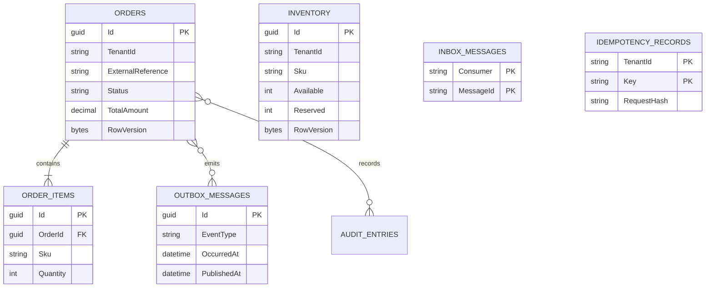

# Data model

The relational model keeps workflow truth, deduplication records, and publication
intent in one transactional boundary.

## Invariants

- `(TenantId, ExternalReference)` is unique for orders.
- `(TenantId, Sku)` is unique for inventory.
- Available and reserved quantities cannot become negative through domain methods.
- Order totals are derived from immutable line values.
- `(Consumer, MessageId)` is the consumer deduplication boundary.
- `(TenantId, Key)` is the API idempotency boundary.
- SQL Server rowversion and SQLite concurrency tokens detect stale writes.

SQLite is used only for local/test portability. Azure SQL uses decimal precision,
rowversion, indexes, backups, and operational controls appropriate to the hosted
environment. A production system should run versioned migrations as a separate
release step instead of letting an application instance initialize the database.
